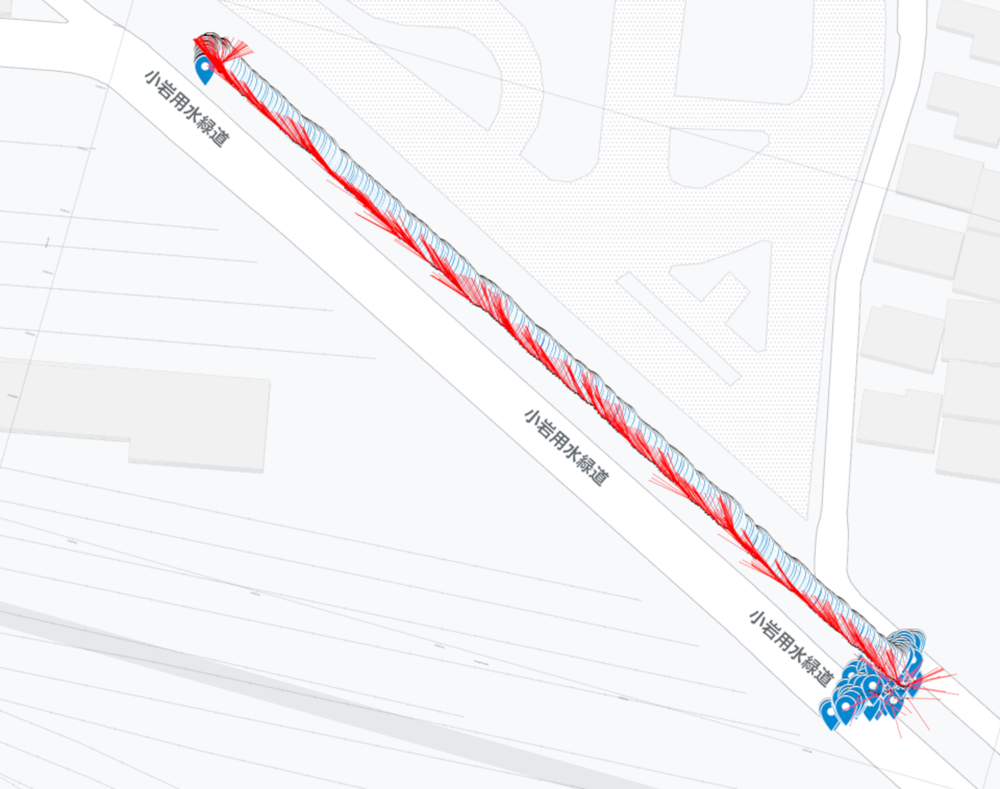
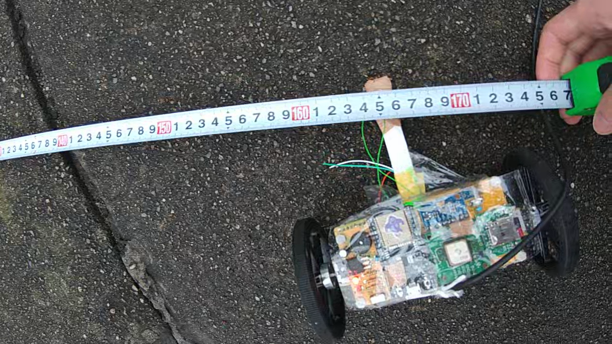

# セキュリティ・ネクストキャンプ 2021 チームC

# ミッション内容

Cチームでは以下の3点をミッションとします。

- できるだけ直進する
- 精度・速度を求める
- 安定したアルゴリズム

# サクセス・クライテリア

ここにサクセス・クライテリアを記載する．

|||
|:---:|:---|
|ミニマムサクセス|一度ゴールに向いたら逆向きに走行しない・5m以内に1度でも接近する・停止せずにゴールまで走行する|
|ミドルサクセス|3m以内に1度でも接近する・実行時エラーへの対策を検討および実装する|
|フルサクセス|1m以内で停止する・実行時エラーへの対策で工夫した点についてまとめて共有する|
|アドバンスドサクセス||

# 誘導アルゴリズムの説明
* 100msごとにGPS、9軸のデータに基づいてモーター出力を補正  
* 現在位置の座標とゴール座標から進行方向を決定  
* 地磁気から向いている方向を取得して、補正をかける  
(20度以上ズレていたら、その場で回転(フルパワーで左右逆回転)する、
20度未満であれば、進みながら曲げたい方向の出力を絞る)
スタートから1mごとにサブゴールを設定して、そこに進む

# 実験動画
[実験動画](https://www.youtube.com/watch?v=b3c2h0b3szk)

# 実験ログ
経路の様子です

目標地点からの誤差は、165cmでした

